# Attributes


Importamos librerias basicas.


```python
import pandas as pd
import matplotlib.pyplot as plt
import seaborn as sns
sns.set_style("whitegrid")
import matplotlib
matplotlib.rcParams['figure.figsize'] = [10, 6]
```

Cargamos el archivo y vemos que contiene


```python
data = pd.read_csv('breast-cancer.csv')
```


```python
data.head()
```


<div>
<style scoped>
    .dataframe tbody tr th:only-of-type {
        vertical-align: middle;
    }

    .dataframe tbody tr th {
        vertical-align: top;
    }

    .dataframe thead th {
        text-align: right;
    }
</style>
<table border="1" class="dataframe">
  <thead>
    <tr style="text-align: right;">
      <th></th>
      <th>id</th>
      <th>diagnosis</th>
      <th>radius_mean</th>
      <th>texture_mean</th>
      <th>perimeter_mean</th>
      <th>area_mean</th>
      <th>smoothness_mean</th>
      <th>compactness_mean</th>
      <th>concavity_mean</th>
      <th>concave points_mean</th>
      <th>...</th>
      <th>texture_worst</th>
      <th>perimeter_worst</th>
      <th>area_worst</th>
      <th>smoothness_worst</th>
      <th>compactness_worst</th>
      <th>concavity_worst</th>
      <th>concave points_worst</th>
      <th>symmetry_worst</th>
      <th>fractal_dimension_worst</th>
      <th>Unnamed: 32</th>
    </tr>
  </thead>
  <tbody>
    <tr>
      <th>0</th>
      <td>842302</td>
      <td>M</td>
      <td>17.99</td>
      <td>10.38</td>
      <td>122.80</td>
      <td>1001.0</td>
      <td>0.11840</td>
      <td>0.27760</td>
      <td>0.3001</td>
      <td>0.14710</td>
      <td>...</td>
      <td>17.33</td>
      <td>184.60</td>
      <td>2019.0</td>
      <td>0.1622</td>
      <td>0.6656</td>
      <td>0.7119</td>
      <td>0.2654</td>
      <td>0.4601</td>
      <td>0.11890</td>
      <td>NaN</td>
    </tr>
    <tr>
      <th>1</th>
      <td>842517</td>
      <td>M</td>
      <td>20.57</td>
      <td>17.77</td>
      <td>132.90</td>
      <td>1326.0</td>
      <td>0.08474</td>
      <td>0.07864</td>
      <td>0.0869</td>
      <td>0.07017</td>
      <td>...</td>
      <td>23.41</td>
      <td>158.80</td>
      <td>1956.0</td>
      <td>0.1238</td>
      <td>0.1866</td>
      <td>0.2416</td>
      <td>0.1860</td>
      <td>0.2750</td>
      <td>0.08902</td>
      <td>NaN</td>
    </tr>
    <tr>
      <th>2</th>
      <td>84300903</td>
      <td>M</td>
      <td>19.69</td>
      <td>21.25</td>
      <td>130.00</td>
      <td>1203.0</td>
      <td>0.10960</td>
      <td>0.15990</td>
      <td>0.1974</td>
      <td>0.12790</td>
      <td>...</td>
      <td>25.53</td>
      <td>152.50</td>
      <td>1709.0</td>
      <td>0.1444</td>
      <td>0.4245</td>
      <td>0.4504</td>
      <td>0.2430</td>
      <td>0.3613</td>
      <td>0.08758</td>
      <td>NaN</td>
    </tr>
    <tr>
      <th>3</th>
      <td>84348301</td>
      <td>M</td>
      <td>11.42</td>
      <td>20.38</td>
      <td>77.58</td>
      <td>386.1</td>
      <td>0.14250</td>
      <td>0.28390</td>
      <td>0.2414</td>
      <td>0.10520</td>
      <td>...</td>
      <td>26.50</td>
      <td>98.87</td>
      <td>567.7</td>
      <td>0.2098</td>
      <td>0.8663</td>
      <td>0.6869</td>
      <td>0.2575</td>
      <td>0.6638</td>
      <td>0.17300</td>
      <td>NaN</td>
    </tr>
    <tr>
      <th>4</th>
      <td>84358402</td>
      <td>M</td>
      <td>20.29</td>
      <td>14.34</td>
      <td>135.10</td>
      <td>1297.0</td>
      <td>0.10030</td>
      <td>0.13280</td>
      <td>0.1980</td>
      <td>0.10430</td>
      <td>...</td>
      <td>16.67</td>
      <td>152.20</td>
      <td>1575.0</td>
      <td>0.1374</td>
      <td>0.2050</td>
      <td>0.4000</td>
      <td>0.1625</td>
      <td>0.2364</td>
      <td>0.07678</td>
      <td>NaN</td>
    </tr>
  </tbody>
</table>
<p>5 rows × 33 columns</p>
</div>


Podemos ver que tenemos un atributo Unnamed que parece contener valores NaN que tendremos que remover mas adelante.
Tiene un atributo id que no aporta valor y tambien tendremos que eliminar.


```python
diagnosis = data['diagnosis'].value_counts()
```


```python
sns.barplot(diagnosis.index, diagnosis.values,)
plt.title('Classes Occurrences')
plt.ylabel('Number of Occurrences', fontsize=12)
plt.xlabel('Class', fontsize=12)
```


    Text(0.5,0,'Class')


```python
diagnosis.columns
```


    Index(['B', 'M'], dtype='object')


Tenemos mas ocurrencias de la clase 'B'que de 'M', como era de esperarse.


```python
sns.distplot(data['radius_mean'])
```


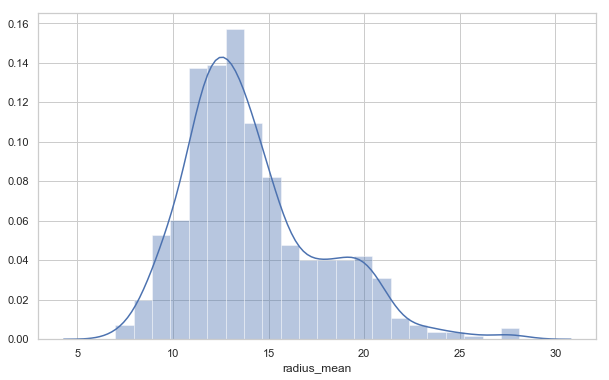


```python
sns.distplot(data['texture_mean'])
```


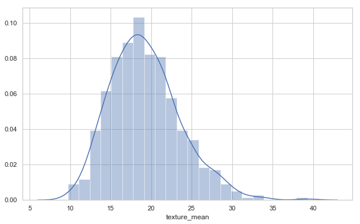


```python
sns.distplot(data['perimeter_mean'])
```


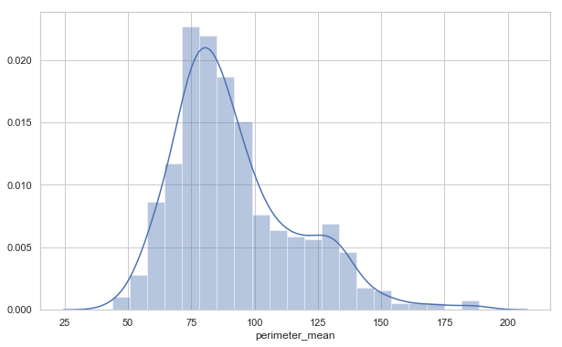


```python
sns.distplot(data['area_mean'])
```


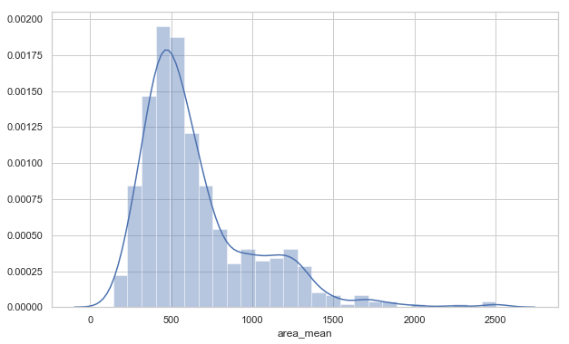


```python
sns.distplot(data['smoothness_mean'])
```


```python
sns.distplot(data['compactness_mean'])
```


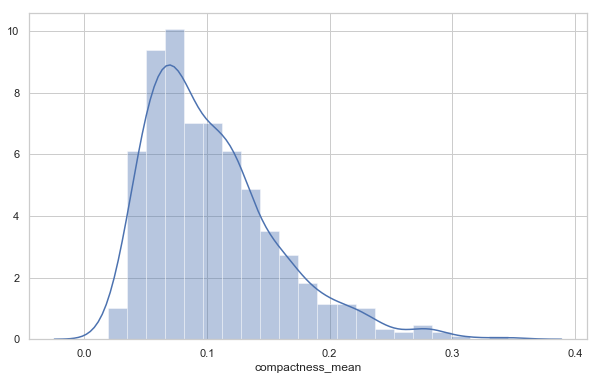


```python
sns.distplot(data['concavity_mean'])
```


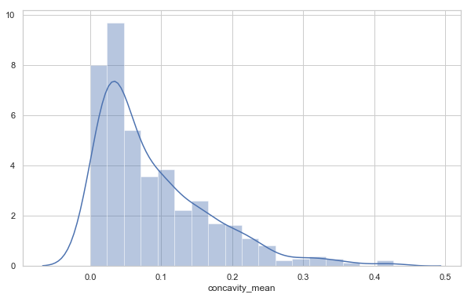


```python
sns.distplot(data['concave points_mean'])
```


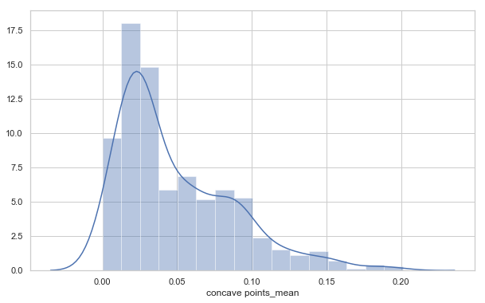


```python
sns.distplot(data['symmetry_mean'])
```

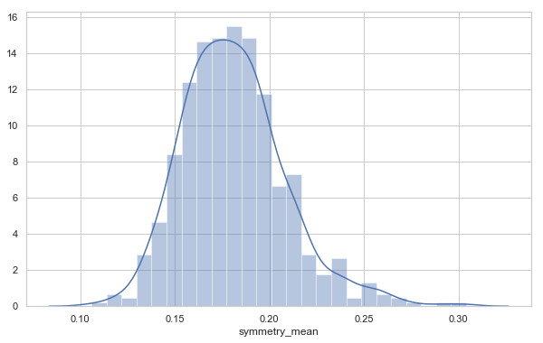


```python
sns.distplot(data['fractal_dimension_mean'])
```


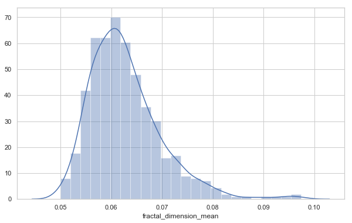


```python
sns.distplot(data['radius_se'])
```


```python
sns.distplot(data['texture_se'])
```


```python
sns.distplot(data['texture_se'])
```


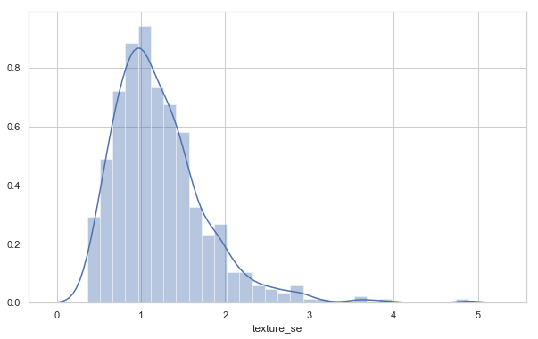


```python
sns.distplot(data['perimeter_se'])
```


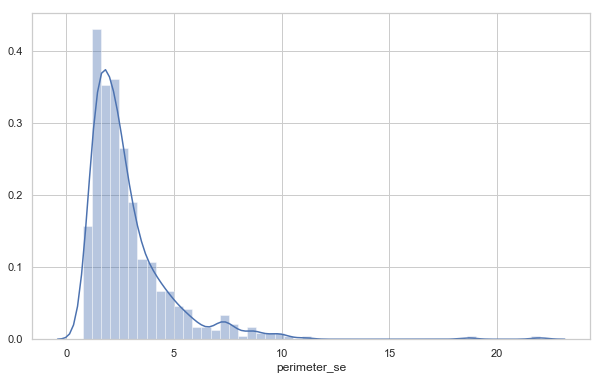


```python
sns.distplot(data['area_se'])
```


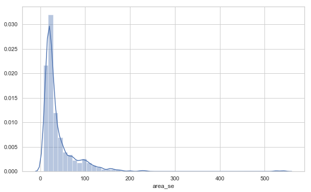


```python
sns.distplot(data['smoothness_se'])
```


```python
sns.distplot(data['compactness_se'])
```


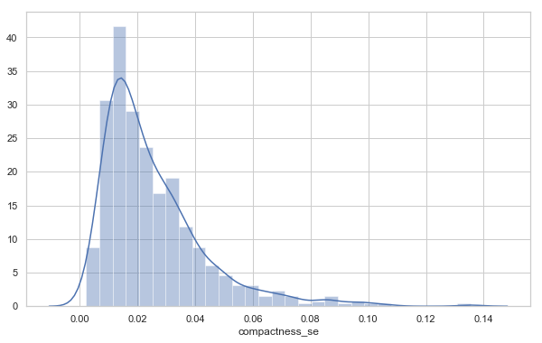


```python
sns.distplot(data['concavity_se'])
```


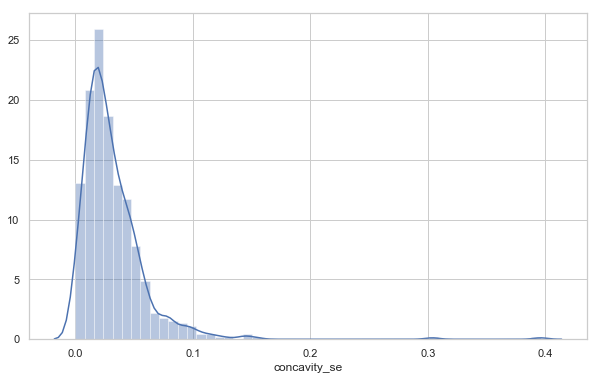


```python
sns.distplot(data['concave points_se'])
```


```python
sns.distplot(data['symmetry_se'])
```


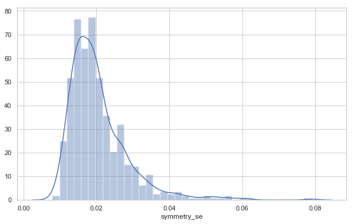


```python
sns.distplot(data['fractal_dimension_se']) 
```


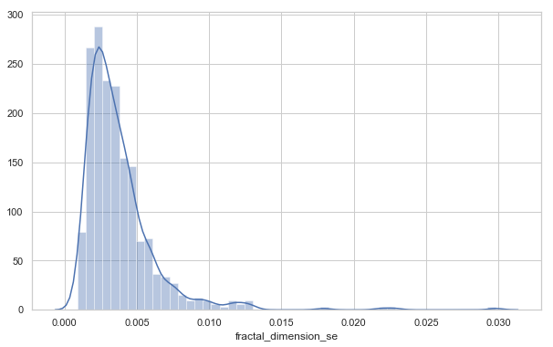


```python
sns.distplot(data['radius_worst'])
```


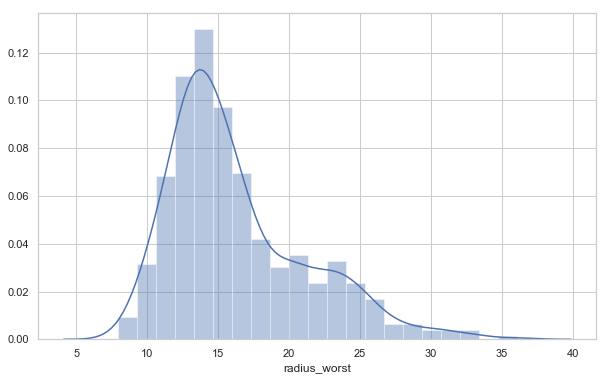


```python
sns.distplot(data['texture_worst'])
```


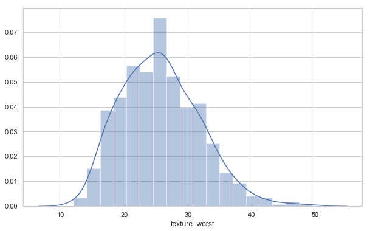


```python
sns.distplot(data['perimeter_worst'])
```


```python
sns.distplot(data['area_worst'])
```


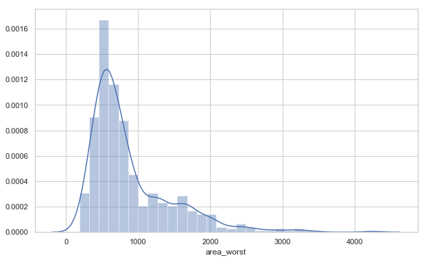


```python
sns.distplot(data['smoothness_worst'])
```


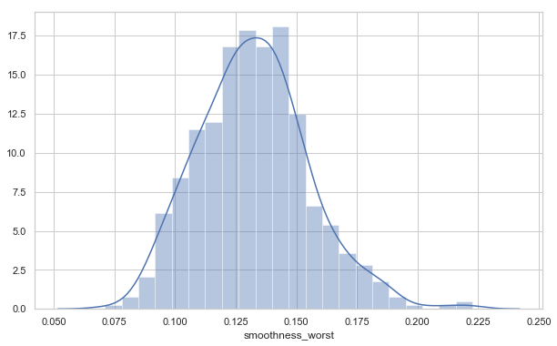


```python
sns.distplot(data['compactness_worst'])
```

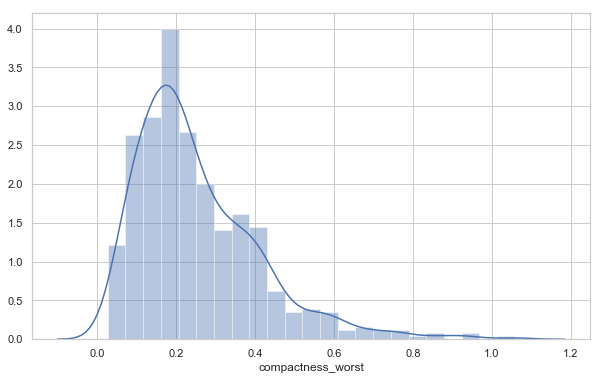


```python
sns.distplot(data['concavity_worst'])
```


```python
sns.distplot(data['concave points_worst'])
```


```python
sns.distplot(data['symmetry_worst'])
```


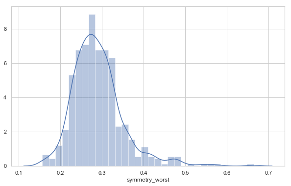


```python
sns.distplot(data['fractal_dimension_worst'])
```


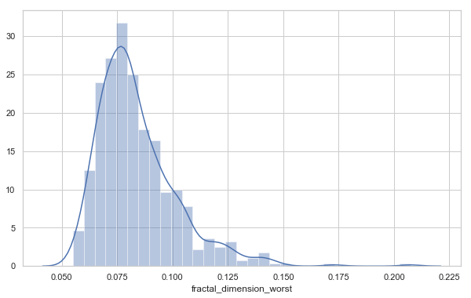


Podemos ver que casi todos los valores que toman los atributos siguen una distribucion normal o beta.


[Missing Values ➡](./4_missing_values.md)