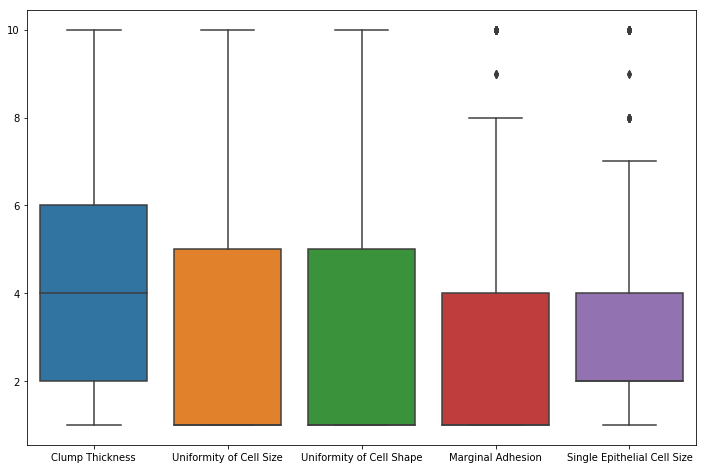
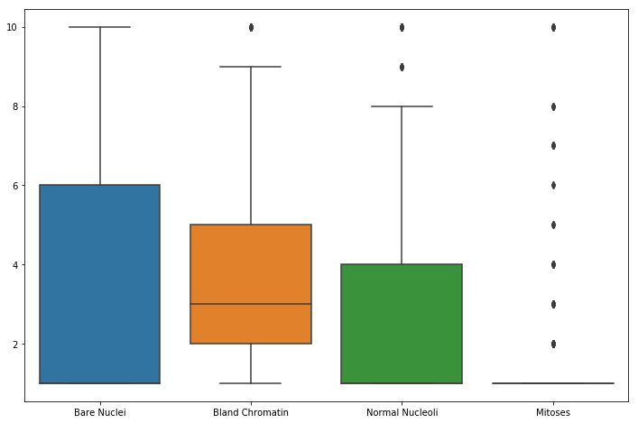

# Breast Cancer Wisconsin


En este proyecto se va a realizar un estudio sobre el dataset [Breast Cancer Wisconsin](https://archive.ics.uci.edu/ml/datasets/Breast+Cancer+Wisconsin+%28Original%29), obtenido de [UCI](https://archive.ics.uci.edu/ml/index.php).
## Introducción 
Las celulas cancerigenas se crean cuando los genes responsables por la divison celular estan dañados. La carcinogénesis (conjunto de fenómenos que determinan la aparición y desarrollo de un cáncer) es causada por mutación y epimutación (cambio en la estructura química del ADN que no altera la secuencia de codificación del ADN) del material genético en las células normales, las cuales desequilibran el balance del material genético en las células normales entre la proliferación y muerte de las células. Esto resulta en una division celular fuera de control y la evolución de esas células por selección natural. La descontrolada y en la mayoría de los casos, rápida proliferación de las céulas puede llevar a tumores benignos o malignos (cancer). Los tumores benignos no invaden otras partes del cuerpo o otros tejidos, mientras que los tumores malignos pueden invadir otros organos y llegar a lugares lejanos en el cuerpo (metastasis), conviertiendose asi, en una amenaza le.
<!--
Cancer cells are created when the genes responsible for regulating [cell division](https://en.wikipedia.org/wiki/Cell_division "Cell division") are damaged. Carcinogenesis is caused by mutation and epimutation of the genetic material of normal cells, which upsets the normal balance between proliferation and cell death. This results in uncontrolled cell division and the [evolution of those cells](https://en.wikipedia.org/wiki/Somatic_evolution_in_cancer "Somatic evolution in cancer") by [natural selection](https://en.wikipedia.org/wiki/Natural_selection "Natural selection") in the body. The uncontrolled and often rapid proliferation of cells can lead to benign or malignant tumours (cancer). [Benign tumors](https://en.wikipedia.org/wiki/Benign_tumor "Benign tumor") do not spread to other parts of the body or invade other tissues. [Malignant tumors](https://en.wikipedia.org/wiki/Malignant_tumor) can invade other organs, spread to distant locations ([metastasis](https://en.wikipedia.org/wiki/Metastasis "Metastasis")) and become life-threatening.
-->
El dataset ser estudiado esta compuesto por los resultados obtenidos mediante biopsias de ​FNA​ (fine needle aspiration), contiene 699 instancias con 10 atributos y una clase de salida (benigno o malicioso).
En una biopsia FNA, el doctor usa una aguja muy fina y hueca con una jeringa para poder aspirar una pequeña cantidad de tejido o fluido de un area sospechosa. La muestra recolectada es revisada para ver si hay celulas cancerigenas.

<!--
In an FNA biopsy, the doctor uses a very thin, hollow needle attached to a syringe to withdraw (aspirate) a small amount of tissue or fluid from a suspicious area. The biopsy sample is then checked to see if there are cancer cells in it.
-->
El dataset fue creado por el Dr.  WIlliam H. Wolberg (medico) en los hospitales de la universidad de Wisconsin en Madison, Wisconsin, USA.
Las muestras llegaban periodicamente mientras el Dr. Wolberg reportaba sus casos clínicos. Por esto, los datos están agrupados por orden cronológico, estos fueron recolectados entre Enero de 1989 y Noviembre de 1991.
<!--
This dataset was created by Dr. WIlliam H. Wolberg (physician)  at the University of Wisconsin Hospitals (Madison, Wisconsin, USA).
Samples arrive periodically as Dr. Wolberg reports his clinical cases. The database therefore reflects this chronological grouping of the data. The data groups were collected between January 1989 and November 1991. 
-->

| Grupo  | Instancias | Mes       | Año  |
|--------|------------|-----------|------|
| 1      | 367        | Enero     | 1989 |
| 2      | 70         | Octubre   | 1989 |
| 3      | 31         | Febrero   | 1990 |
| 4      | 17         | Abril     | 1990 |
| 5      | 48         | Agosto    | 1990 |
| 6      | 49         | Enero     | 1991 | 
| 7      | 31         | Junio     | 1991 | 
| 8      | 86         | Noviembre | 1991 | 

Los datos ya fueron limpiados en dos ocasiones.
* *Jan 10, 1991*
* *Nov 22,1991*

Aunque se encuentran missing values en Bare Nuclei como veremos mas adelante.

Un total de 699 instancias.

<!--
* Group 1: 367 instances (January 1989)  
* Group 2: 70 instances (October 1989)  
* Group 3: 31 instances (February 1990)  
* Group 4: 17 instances (April 1990)  
* Group 5: 48 instances (August 1990)  
* Group 6: 49 instances (Updated January 1991)  
* Group 7: 31 instances (June 1991)  
* Group 8: 86 instances (November 1991)

A total of 699 instances.
-->

## Problema

El problema consiste en predecir si una muestra de células recolectada mediante ​FNA​ es benigna o no en base a una serie de atributos.

## Estudio de atributos

| Atributo                    | Valor Minimo | Valor Maximo  |
|-----------------------------|--------------|---------------|
| Sample code number          | 61634        | 13454352      |
| Clump Thickness             | 1            | 10            |
| Uniformity of Cell Size     | 1            | 10            |
| Uniformity of Cell Shape    | 1            | 10            |
| Marginal Adhesion           | 1            | 10            |
| Single Epithelial Cell Size | 1            | 10            |
| Bare Nuclei                 | 1            | 10            |
| Bland Chromatin             | 1            | 10            |
| Normal Nucleoli             | 1            | 10            |
| Mitoses                     | 1            | 10            |
| Class                       | 2 (Benigno)  | 4 (Maligno)   |  

La variable objetivo de este dataset es “Class” la cual determina si un tumor es benigno o maligno (con el valor 2 o 4 respectivamente).

A simple vista podemos descartar el atributo id ya que no aporta valor y causa ruido. 


A continuación una breve descripción de las definiciones  para los atributos del dataset y porque pueden ser relevantes.

**Clump Thickness:** `​Grosor de la masa a analizar`
*Normalmente las células benignas suelen estar agrupadas en una única capa mientras que las malignas se agrupan en más de una por lo cual el grosor parece ser un factor importante al momento de clasificar.*

**Uniformity of Cell Size:** `​Uniformidad del tamaño en las células extraídas` 
*Las células cancerígenas suelen variar en tamaño.*

**Uniformity of Cell Shape:** `​Uniformidad de la forma en las células extraídas`  
*Las células cancerígenas suelen variar en forma.*

Estos últimos dos atributos también parecen ser importantes al momento de realizar la clasificación y pueden estar correlacionados.

**Marginal Adhesion:** `​Adhesión de las células` 
*Las células normales tienen a estar juntas mientras que las cancerígenas tienden a separarse.*

**Single Epithelial Cell Size:** `​Tamaño de las células` 
*Las células cancerígenas tienden a ser más grandes.*

**Bare Nuclei:** ​`Núcleo que no está cubierto por el citoplasma` *Comunes en tumores benignos.*

**Bland Chromatin:** ​`Uniformidad de la textura`
*En las células cancerígenas suele ser más gruesa.*

**Normal Nucleoli:** ​`Son pequeñas estructuras en los núcleos.` 
*En las células normales es apenas visible, o ni siquiera es visible mientras que en las células cancerígenas es más prominente.*

**Mitoses:** ​`División de las células.` 
*En las células cancerígenas suelen ser más asimétricas.*

**Class:** ​`Tipo de tumor`
* *2 para benigno*
* *4 para maligno*

## Analizando el Dataset (código)

### Importando librerias

```python
import matplotlib.pyplot as plt
import pandas  as pd
import numpy   as np
import seaborn as sns
```

### Cargando el dataset

```python
dataset = pd.read_csv('breast_cancer.csv')
```

### Eliminando la columna Id number


```python
dataset = dataset.drop('id number', 1)
```
### Missing Values

```python
dataset.info()
```

    <class 'pandas.core.frame.DataFrame'>
    RangeIndex: 699 entries, 0 to 698
    Data columns (total 10 columns):
    Clump Thickness                699 non-null int64
    Uniformity of Cell Size        699 non-null int64
    Uniformity of Cell Shape       699 non-null int64
    Marginal Adhesion              699 non-null int64
    Single Epithelial Cell Size    699 non-null int64
    Bare Nuclei                    699 non-null object
    Bland Chromatin                699 non-null int64
    Normal Nucleoli                699 non-null int64
    Mitoses                        699 non-null int64
    Class                          699 non-null int64
    dtypes: int64(9), object(1)
    memory usage: 54.7+ KB
    


```python
missing_values = dataset[dataset['Bare Nuclei']=='?']
```

Podemos verque la variable `Bare Nuclei` tiene por lo menos una ocurrencia con un tipo de dato extraño.

```python
missing_values
```


<div>
<style scoped>
    .dataframe tbody tr th:only-of-type {
        vertical-align: middle;
    }

    .dataframe tbody tr th {
        vertical-align: top;
    }

    .dataframe thead th {
        text-align: right;
    }
</style>
<table border="1" class="dataframe">
  <thead>
    <tr style="text-align: right;">
      <th></th>
      <th>Clump Thickness</th>
      <th>Uniformity of Cell Size</th>
      <th>Uniformity of Cell Shape</th>
      <th>Marginal Adhesion</th>
      <th>Single Epithelial Cell Size</th>
      <th>Bare Nuclei</th>
      <th>Bland Chromatin</th>
      <th>Normal Nucleoli</th>
      <th>Mitoses</th>
      <th>Class</th>
    </tr>
  </thead>
  <tbody>
    <tr>
      <th>23</th>
      <td>8</td>
      <td>4</td>
      <td>5</td>
      <td>1</td>
      <td>2</td>
      <td>?</td>
      <td>7</td>
      <td>3</td>
      <td>1</td>
      <td>4</td>
    </tr>
    <tr>
      <th>40</th>
      <td>6</td>
      <td>6</td>
      <td>6</td>
      <td>9</td>
      <td>6</td>
      <td>?</td>
      <td>7</td>
      <td>8</td>
      <td>1</td>
      <td>2</td>
    </tr>
    <tr>
      <th>139</th>
      <td>1</td>
      <td>1</td>
      <td>1</td>
      <td>1</td>
      <td>1</td>
      <td>?</td>
      <td>2</td>
      <td>1</td>
      <td>1</td>
      <td>2</td>
    </tr>
    <tr>
      <th>145</th>
      <td>1</td>
      <td>1</td>
      <td>3</td>
      <td>1</td>
      <td>2</td>
      <td>?</td>
      <td>2</td>
      <td>1</td>
      <td>1</td>
      <td>2</td>
    </tr>
    <tr>
      <th>158</th>
      <td>1</td>
      <td>1</td>
      <td>2</td>
      <td>1</td>
      <td>3</td>
      <td>?</td>
      <td>1</td>
      <td>1</td>
      <td>1</td>
      <td>2</td>
    </tr>
    <tr>
      <th>164</th>
      <td>5</td>
      <td>1</td>
      <td>1</td>
      <td>1</td>
      <td>2</td>
      <td>?</td>
      <td>3</td>
      <td>1</td>
      <td>1</td>
      <td>2</td>
    </tr>
    <tr>
      <th>235</th>
      <td>3</td>
      <td>1</td>
      <td>4</td>
      <td>1</td>
      <td>2</td>
      <td>?</td>
      <td>3</td>
      <td>1</td>
      <td>1</td>
      <td>2</td>
    </tr>
    <tr>
      <th>249</th>
      <td>3</td>
      <td>1</td>
      <td>1</td>
      <td>1</td>
      <td>2</td>
      <td>?</td>
      <td>3</td>
      <td>1</td>
      <td>1</td>
      <td>2</td>
    </tr>
    <tr>
      <th>275</th>
      <td>3</td>
      <td>1</td>
      <td>3</td>
      <td>1</td>
      <td>2</td>
      <td>?</td>
      <td>2</td>
      <td>1</td>
      <td>1</td>
      <td>2</td>
    </tr>
    <tr>
      <th>292</th>
      <td>8</td>
      <td>8</td>
      <td>8</td>
      <td>1</td>
      <td>2</td>
      <td>?</td>
      <td>6</td>
      <td>10</td>
      <td>1</td>
      <td>4</td>
    </tr>
    <tr>
      <th>294</th>
      <td>1</td>
      <td>1</td>
      <td>1</td>
      <td>1</td>
      <td>2</td>
      <td>?</td>
      <td>2</td>
      <td>1</td>
      <td>1</td>
      <td>2</td>
    </tr>
    <tr>
      <th>297</th>
      <td>5</td>
      <td>4</td>
      <td>3</td>
      <td>1</td>
      <td>2</td>
      <td>?</td>
      <td>2</td>
      <td>3</td>
      <td>1</td>
      <td>2</td>
    </tr>
    <tr>
      <th>315</th>
      <td>4</td>
      <td>6</td>
      <td>5</td>
      <td>6</td>
      <td>7</td>
      <td>?</td>
      <td>4</td>
      <td>9</td>
      <td>1</td>
      <td>2</td>
    </tr>
    <tr>
      <th>321</th>
      <td>3</td>
      <td>1</td>
      <td>1</td>
      <td>1</td>
      <td>2</td>
      <td>?</td>
      <td>3</td>
      <td>1</td>
      <td>1</td>
      <td>2</td>
    </tr>
    <tr>
      <th>411</th>
      <td>1</td>
      <td>1</td>
      <td>1</td>
      <td>1</td>
      <td>1</td>
      <td>?</td>
      <td>2</td>
      <td>1</td>
      <td>1</td>
      <td>2</td>
    </tr>
    <tr>
      <th>617</th>
      <td>1</td>
      <td>1</td>
      <td>1</td>
      <td>1</td>
      <td>1</td>
      <td>?</td>
      <td>1</td>
      <td>1</td>
      <td>1</td>
      <td>2</td>
    </tr>
  </tbody>
</table>
</div>

Confirmamos que tiene missing values asi que vamos a averiguar cuantos missing values son y en base a eso podriamos tener una idea que medida tomar.

### Averiguando el impacto del missing value


```python
dataset['Class'].value_counts()
```


    2    458
    4    241
    Name: Class, dtype: int64


```python
missing_values['Class'].value_counts()
```


    2    14
    4     2
    Name: Class, dtype: int64


```python
(100*14)/458
```


    3.056768558951965


```python
(100*2)/241
```


    0.8298755186721992


Para los casos benignos (458) tenemos un `3.056%` de missing values mientras que para los casos malignos (241) tenemos un total de `0.829%` missing values.

```python
dataset = dataset.drop(dataset.index[missing_values.index])
```
### Outlyers

Para poder analizar los outliers vamos a utilizar diagramas de caja, una tecnica muy popular para analizar variables univariantes.

```python
fig, ax = plt.subplots(figsize=(12,8))
sns.boxplot(ax=ax, data=dataset.iloc[:, : 5])
```





```python
fig, ax = plt.subplots(figsize=(12,8))
sns.boxplot(ax=ax, data=dataset.iloc[:, 5:9])
```




Notar que no se realizo un diagrama para la variable de salida ya que en este caso son dos salidas y el diagrama no aportaria informacion relevante.


<!-- Correlacion en mitosis? -->
## Analizando el Dataset (RapidMiner)
