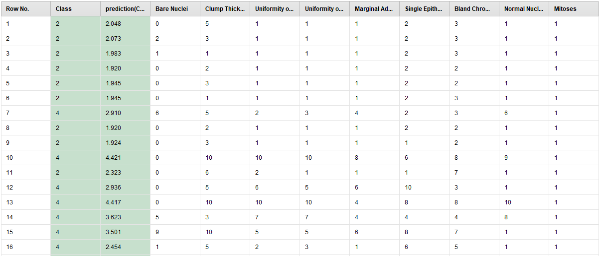
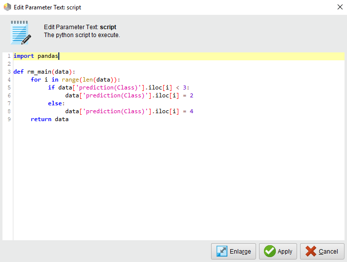

# Support Vector Machine

_Este modelo se construye sobre el utilizado en [missing values](./4_missing_values_rapidminer.md)_.

Primero convertimos los valores a numéricos ya que el atributo `Bare Nuclei` al contener missing values es de tipo `polynomial`.


Separamos en entrenamiento y validación con el modulo `Split Data`, separamos en `0.7` para entrenamiento y `0.3` para validación.

A esto le conectamos un bloque de `SVM` con los parámetros por defecto.

| Parametros | Valores |
| -:| - | 
| C | 0.0 |
| Convergence epsilon | 0.001 |
| Kernel Cache | 200 |

A esto le conectamos un bloque `Apply Model` para poder predecir nuestros datos de test con el modelo entrenado.


Podemos ver que los valores predecidos son reales.



Para poder compararlos con la clase vamos a utilizar un modulo que nos permite utilizar código python, `Execute Python`. Esto es un plugin que se tiene que descargar desde el [marketplace](https://marketplace.rapidminer.com/UpdateServer/faces/product_details.xhtml?productId=rmx_python_scripting). Primero asignamos un archivo de salida para los logs.


Normalmente usaríamos un código del tipo:

```python
data = data['prediction(Class)'].apply(lambda x: get_class(x))
```

pero este tipo de código causa problemas en este modulo por lo cual usaremos un simple `for`.




Podemos ver que casi todos los ejemplos estan bien clasificados.


Ahora intentaremos evaluar la performance con el modulo `Cross Validation` y con la medida RMSE _(Root Mean Squared Error)_.


## root_mean_squared_error

root_mean_squared_error: 0.457 +/- 0.093 (micro average: 0.466 +/- 0.000)

Podemos ver que en promedio tenemos un error de 0.457 +/- 0.093.
Como nuestras clases son 2 y 4 un rmse de 0.45 es un buen resultado ya que algo clasificado con un valor 2.45, 1.55, 3.55 o 4.45 es fácil de aproximar a su clase real.