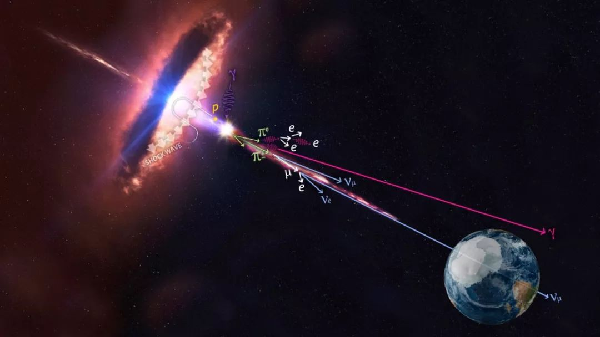

# PLAsTiCC

## Introducción 

El ojo humano ha sido el árbitro de la clasificación de las fuentes astronómicas en el cielo nocturno durante cientos de años. Pero una nueva instalación, el Gran telescopio sinóptico (LSST), está a punto de revolucionar el campo, descubriendo de 10 a 100 veces más fuentes astronómicas que varían en el cielo nocturno de lo que jamás hayamos conocido. ¡Algunas de estas fuentes serán completamente sin precedentes!

[PLAsTiCC-2018](https://www.kaggle.com/c/PLAsTiCC-2018)