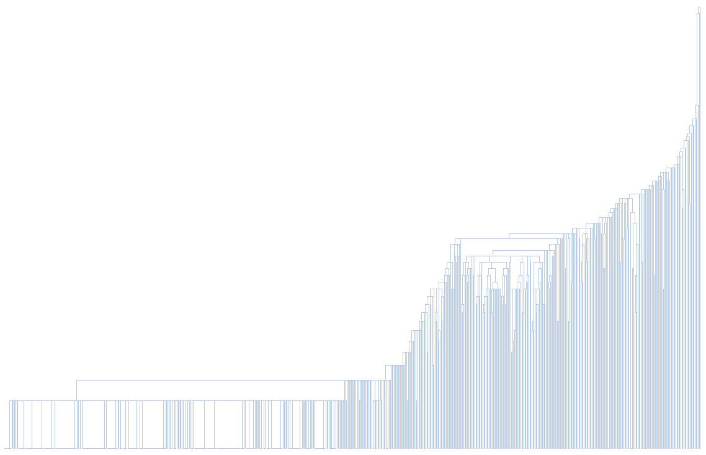
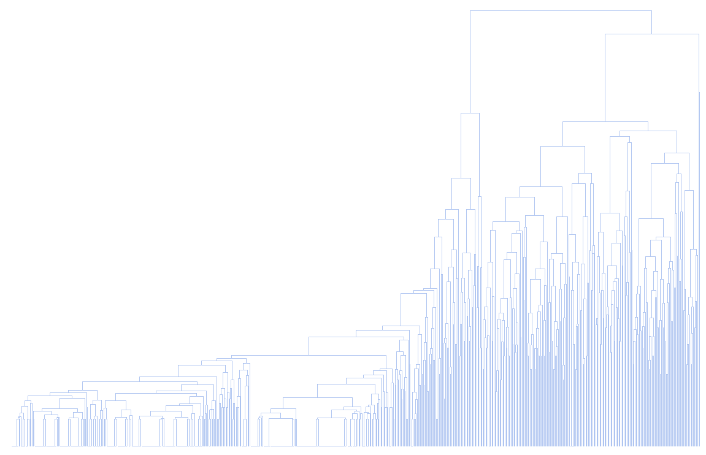

# Hierarchical Clustering

### Proceso en RapidMiner

__Seed = 2018__

1- Agregamos el dataset en un proceso nuevo con el modulo `Retrive`.

2- Indicamos que el atributo **id** com id con el modulo `Set Role`, esto nos va a ser util mas adelante cuando intentemos realizar un join.

3- Utilizamos el modulo `Multiply` para tener un conjunto de datos que mantenga el atributo `Class` _(lo vamos a eliminar a continuación)_.

4- Eliminamos los atributos que no vamos a utilizar con un modulo de `Select Attributes`, en este caso vamos a eliminar la clase _(`Class`)_.

5- Como vimos en [Missing Values](./), este dataset contiene valores faltantes en el atributo **Bare Nuclei**. Vamos a removerlos con el modulo `Filter Examples`.

6- Los valores del atributo **Bare Nuclei** estan siendo considerados como _polynomial_ vamos a utilizar el modulo de `Parse Numbers` para convertirlos en números.

7- Agregamos el modulo de `Clustering (Agglomerative Clustering)`.

8- Agregamos un join por id con los datos originales para recuperar el atributo de la clase. 

9- Agregamos un modulo `Filter` y a medida que realizamos los experimentos vamos filtrando por clusters.

### Process

## Experimentos

Agglomerative Clustering cuenta con 2 hiperparametros:

* Mode: Este parámetro especifica el modo de agrupación o el criterio de vinculación.

* Mesure: Medida de distancia.

| Mode       | Number of Clusters    |
|----------  | --------------------- |
| SingleLink | 1365 |
| CompleteLink | 1365 |
| AverageLink | 1365 |

_SingleLink_

_CompleteLink_

_AverageLink_

A excepcion del primer dendograma obtenido con Single Link podemos ver que con Complete Link y Average Link aproximadamente un poco mas 1/3 de los datos esta siendo separado por una de las separaciones mas altas, obteniendo del lado izquerdo la clase 2 y del lado derecho la clase 4.